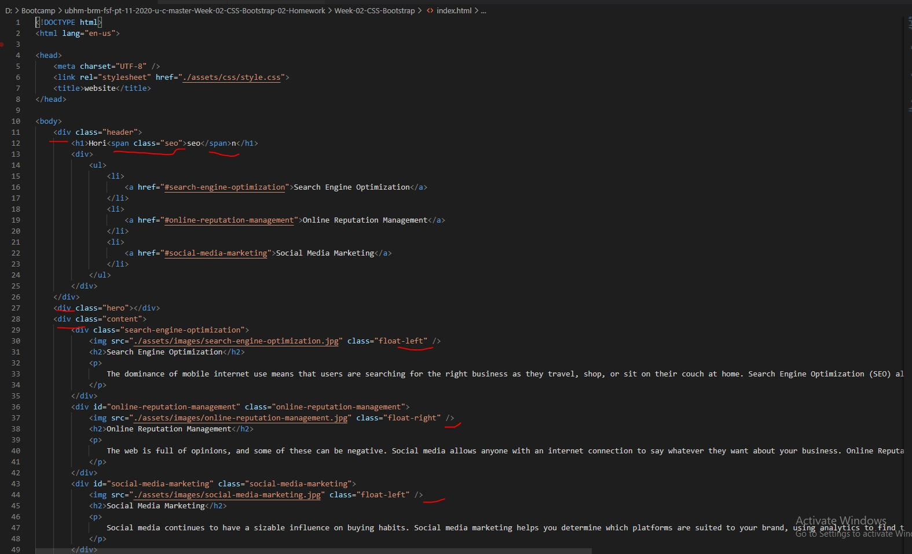

# Code-Refractoring
**The Main Objective** of this project is to improve the web **accesability** of the client's website.

## In this project, I modified the code in the files:

```
  * index.html
  * style.css
```

## In order to increase the website's accesability I changed:

```
 * tags in html in a more semantic way
 * managed the  CSS code in order to show less code with the same functionality
 * fixed broken link in html
 * adjusted the images/pading in CSS, that the demo matches the final product
 * added comments in both html & css files, to shed clarity on code
  
```
As well below you can find examples with underlined problems & solutions screenshots of before/after code:

## Before



## After


**Thank you for your assessment!**
